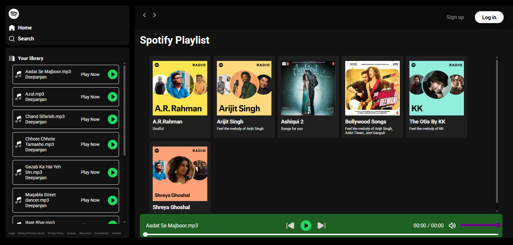

# 🎵 Music Player Web App

A simple and interactive **music player website** built with **HTML, CSS, and JavaScript**.  
It allows you to play, pause, and manage your favorite songs right from the browser.  

---

## 🚀 Features
- 🎶 Play & pause music  
- ⏯️ Next/Previous track controls  
- 📂 Dynamic song loading from a folder  
- ⏱️ Track duration & progress bar  
- 🎨 Modern UI with responsive design  

---

## 📂 Project Structure
Project-Folder/
│── index.html # Main HTML file
│── style.css # Styling (CSS)
│── script.js # Functionality (JavaScript)
│── Songs/ # Folder containing mp3 files
│── svgs/ # SVG icons (play, pause, etc.)
│── README.md # Project documentation

---

## 🛠️ Technologies Used
- **HTML5** – Structure of the app  
- **CSS3** – Styling & responsive design  
- **JavaScript (ES6)** – Core logic for playing music  

---

## 📸 Screenshot


---

## ▶️ How to Run
1. Clone this repository:  
   ```bash
   git clone https://github.com/deepanjan69/Music-Player.git

2. Open the folder in your editor (e.g., VS Code).

3. Run a local server (or simply open index.html in your browser).
